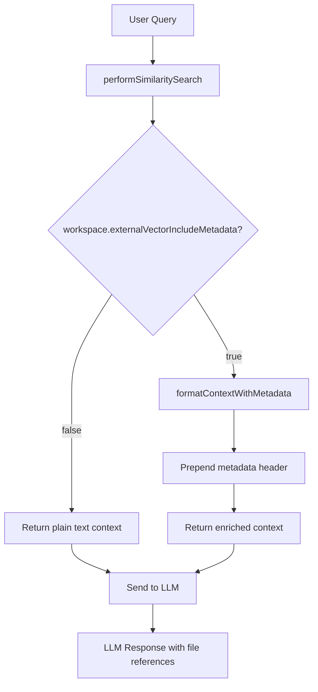

# Enhanced Context Mode Feature Design

## Overview
Add a workspace setting to include full vector payload metadata in the LLM context, allowing the AI to have richer information about code snippets (file paths, line numbers, etc.).

## Current Behavior
Currently, only the `text` field (mapped from `codeChunk`) is sent to the LLM as context:
```
[CONTEXT 0]:
export function App() { ... }
[END CONTEXT 0]
```

## Proposed Enhancement
When enabled, include structured metadata header before each context:
```
[CONTEXT 0]:
<document_metadata>
file: frontend/src/App.js
lines: 10-25
segment: abc123...
</document_metadata>
export function App() { ... }
[END CONTEXT 0]
```

## Implementation Plan

### Phase 1: Database Schema Change
**File:** `server/prisma/schema.prisma`

Add new field to `workspaces` model:
```prisma
model workspaces {
  // ... existing fields ...
  externalVectorIncludeMetadata Boolean? @default(false)
}
```

**Migration SQL:**
```sql
ALTER TABLE workspaces ADD COLUMN externalVectorIncludeMetadata BOOLEAN DEFAULT false;
```

### Phase 2: Workspace Model Update
**File:** `server/models/workspace.js`

Add to writable array:
```javascript
writable: [
  // ... existing fields ...
  "externalVectorIncludeMetadata",
],
```

Add validation:
```javascript
validations: {
  // ... existing validations ...
  externalVectorIncludeMetadata: (value) => {
    if (value === null || value === undefined) return false;
    if (typeof value === "string") {
      return value.toLowerCase() === "true" || value === "1";
    }
    return Boolean(value);
  },
}
```

### Phase 3: QDrant Provider Enhancement
**File:** `server/utils/vectorDbProviders/qdrant/index.js`

Add helper method to format enriched context:
```javascript
/**
 * Formats context text with metadata header for LLM consumption
 * @param {string} text - The main text content
 * @param {Object} payload - The full payload with metadata
 * @param {boolean} includeMetadata - Whether to include metadata header
 * @returns {string} - Formatted context text
 */
formatContextWithMetadata(text, payload, includeMetadata = false) {
  if (!includeMetadata || !payload) return text;

  const metadataLines = [];

  // Add file path
  if (payload.filePath || payload.title) {
    metadataLines.push(`file: ${payload.filePath || payload.title}`);
  }

  // Add line numbers if available
  if (payload.startLine !== undefined && payload.endLine !== undefined) {
    metadataLines.push(`lines: ${payload.startLine}-${payload.endLine}`);
  }

  // Add segment hash if available
  if (payload.segmentHash || payload.docId) {
    metadataLines.push(`segment: ${payload.segmentHash || payload.docId}`);
  }

  // Add any other relevant metadata
  if (payload.pathSegments) {
    const path = Object.values(payload.pathSegments).join('/');
    metadataLines.push(`path: ${path}`);
  }

  if (metadataLines.length === 0) return text;

  const metadataHeader = `<document_metadata>\n${metadataLines.join('\n')}\n</document_metadata>\n`;
  return metadataHeader + text;
}
```

Modify `similarityResponse` to pass through original payload for metadata:
```javascript
async similarityResponse({
  client,
  namespace,
  queryVector,
  similarityThreshold = 0.25,
  topN = 4,
  filterIdentifiers = [],
  schemaMapping = null,
  includeMetadata = false,  // NEW parameter
}) {
  // ... existing code ...

  responses.forEach((response) => {
    // ... existing filtering ...

    // Get translated payload
    const payload = schemaMapping
      ? this.translatePayload(response?.payload, schemaMapping)
      : response?.payload;

    // Format context text with optional metadata
    const contextText = this.formatContextWithMetadata(
      payload?.text || "",
      payload,
      includeMetadata
    );

    result.contextTexts.push(contextText);
    // ... rest of existing code ...
  });

  return result;
}
```

Update `performSimilaritySearch` to pass the setting:
```javascript
async performSimilaritySearch({
  namespace = null,
  input = "",
  LLMConnector = null,
  similarityThreshold = 0.25,
  topN = 4,
  filterIdentifiers = [],
  workspace = null,
}) {
  // ... existing code ...

  const { contextTexts, sourceDocuments } = await this.similarityResponse({
    client,
    namespace: effectiveNamespace,
    queryVector,
    similarityThreshold,
    topN,
    filterIdentifiers,
    schemaMapping,
    includeMetadata: workspace?.externalVectorIncludeMetadata || false,  // NEW
  });

  // ... rest of existing code ...
}
```

### Phase 4: Frontend UI Update
**File:** `frontend/src/pages/WorkspaceSettings/VectorDatabase/ExternalCollection/index.jsx`

Add checkbox after the read-only toggle:
```jsx
<div className="flex items-center gap-x-3">
  <input
    type="checkbox"
    name="externalVectorIncludeMetadata"
    defaultChecked={workspace?.externalVectorIncludeMetadata || false}
    onChange={() => setHasChanges(true)}
    className="w-4 h-4"
  />
  <label className="text-white text-sm">
    {t(
      "vector-workspace.external.include-metadata",
      "Include metadata in LLM context (file path, line numbers)"
    )}
  </label>
</div>
<p className="text-white text-opacity-60 text-xs font-medium pl-7">
  {t(
    "vector-workspace.external.include-metadata-help",
    "When enabled, file paths and line numbers are prepended to each context snippet, helping the LLM provide more precise code references."
  )}
</p>
```

### Phase 5: Add Translations
**File:** `frontend/src/locales/en/common.js`

Add to `vector-workspace.external`:
```javascript
"include-metadata": "Include metadata in LLM context (file path, line numbers)",
"include-metadata-help": "When enabled, file paths and line numbers are prepended to each context snippet, helping the LLM provide more precise code references.",
```

## Data Flow Diagram



## Example Output

**Without metadata (current):**
```
[CONTEXT 0]:
export function App() {
  return <div>Hello World</div>;
}
[END CONTEXT 0]
```

**With metadata enabled:**
```
[CONTEXT 0]:
<document_metadata>
file: frontend/src/App.js
lines: 10-14
segment: abc123def456
</document_metadata>
export function App() {
  return <div>Hello World</div>;
}
[END CONTEXT 0]
```

## Benefits
- LLM knows exactly which file and line numbers the code comes from
- Can provide more accurate responses like "In App.js at lines 10-14..."
- Useful for code navigation suggestions
- Preserves all original Roo Code metadata
- Opt-in feature, won't affect existing workflows

## Files to Modify

| File | Change |
|------|--------|
| `server/prisma/schema.prisma` | Add `externalVectorIncludeMetadata` field |
| `server/models/workspace.js` | Add writable field and validation |
| `server/utils/vectorDbProviders/qdrant/index.js` | Add `formatContextWithMetadata()`, update `similarityResponse()` |
| `frontend/src/pages/WorkspaceSettings/VectorDatabase/ExternalCollection/index.jsx` | Add checkbox toggle |
| `frontend/src/locales/en/common.js` | Add translation strings |

## Migration

Create new migration: `20260415193000_add_external_vector_include_metadata`

```sql
ALTER TABLE workspaces ADD COLUMN externalVectorIncludeMetadata BOOLEAN DEFAULT false;
```
