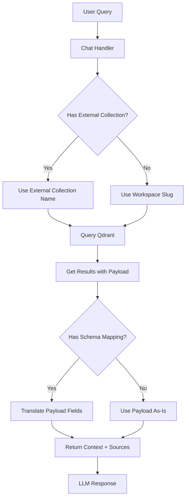

# Roo Code Qdrant Collection Integration Plan

## Overview

This plan outlines how to configure an AnythingLLM workspace to use an existing Qdrant vector database collection created by Roo Code repository indexing, enabling read-only semantic search over code repositories.

## Current Architecture

### AnythingLLM's Approach
- **Namespace = Workspace Slug**: AnythingLLM uses the workspace slug as the Qdrant collection name
- **Expected Payload Schema**:
  ```json
  {
    "text": "the actual text content",
    "title": "document title",
    "docId": "unique document identifier",
    ...other metadata
  }
  ```
- **Key Field**: `text` is required for similarity search responses

### Roo Code's Approach
- **Collection Naming**: Uses hash-based names like `ws-549bb28398322085`
- **Payload Schema**:
  ```json
  {
    "filePath": "frontend/src/locales/ar/common.js",
    "codeChunk": "actual code content here",
    "startLine": 301,
    "endLine": 304,
    "segmentHash": "ecd08249...",
    "pathSegments": {
      "0": "frontend",
      "1": "src",
      ...
    }
  }
  ```

## Schema Differences

| AnythingLLM Field | Roo Code Field | Mapping |
|-------------------|----------------|---------|
| `text` | `codeChunk` | Direct mapping |
| `title` | `filePath` | Direct mapping |
| `docId` | `segmentHash` | Direct mapping |
| N/A | `startLine` | Preserve as metadata |
| N/A | `endLine` | Preserve as metadata |
| N/A | `pathSegments` | Preserve as metadata |

## Implementation Plan

### Phase 1: Database Schema Changes

Add new fields to the `workspaces` table in Prisma schema:

```prisma
model workspaces {
  // ... existing fields ...

  // External Vector Collection Configuration
  externalVectorCollection     String?   // The external collection name (e.g., "ws-549bb28398322085")
  externalVectorSchemaMapping  String?   // JSON string mapping external fields to expected fields
  externalVectorReadOnly       Boolean?  @default(true)  // Prevent writes to external collections
}
```

**Migration SQL**:
```sql
ALTER TABLE workspaces ADD COLUMN externalVectorCollection TEXT;
ALTER TABLE workspaces ADD COLUMN externalVectorSchemaMapping TEXT;
ALTER TABLE workspaces ADD COLUMN externalVectorReadOnly BOOLEAN DEFAULT true;
```

**Files to modify**:
- [`server/prisma/schema.prisma`](server/prisma/schema.prisma) - Add new fields
- Create new migration file

### Phase 2: Workspace Model Updates

Update the workspace model to support the new fields:

**Files to modify**:
- [`server/models/workspace.js`](server/models/workspace.js)

```javascript
// Add to writable array
writable: [
  // ... existing fields ...
  "externalVectorCollection",
  "externalVectorSchemaMapping",
  "externalVectorReadOnly",
],

// Add validations
validations: {
  // ... existing validations ...
  externalVectorCollection: (value) => {
    if (!value || typeof value !== "string") return null;
    return String(value).trim();
  },
  externalVectorSchemaMapping: (value) => {
    if (!value) return null;
    try {
      // Validate it's valid JSON
      JSON.parse(value);
      return value;
    } catch {
      return null;
    }
  },
  externalVectorReadOnly: (value) => {
    if (value === null || value === undefined) return true;
    return Boolean(value);
  },
}
```

### Phase 3: QDrant Provider Modifications

Modify the QDrant provider to support external collections with schema translation:

**Files to modify**:
- [`server/utils/vectorDbProviders/qdrant/index.js`](server/utils/vectorDbProviders/qdrant/index.js)

#### 3.1 Add Schema Translation Helper

```javascript
class QDrant extends VectorDatabase {
  // Default mapping for Roo Code schema
  static ROO_CODE_SCHEMA_MAPPING = {
    text: "codeChunk",
    title: "filePath",
    docId: "segmentHash",
  };

  /**
   * Translates external payload schema to AnythingLLM expected format
   * @param {Object} payload - The external payload
   * @param {Object} schemaMapping - Mapping of {expectedField: externalField}
   * @returns {Object} - Translated payload
   */
  translatePayload(payload, schemaMapping) {
    if (!schemaMapping || !payload) return payload;

    const translated = { ...payload };
    for (const [expectedField, externalField] of Object.entries(schemaMapping)) {
      if (payload[externalField] !== undefined) {
        translated[expectedField] = payload[externalField];
      }
    }
    return translated;
  }

  /**
   * Gets the effective namespace for a workspace
   * @param {Object} workspace - The workspace object
   * @returns {string} - The collection name to use
   */
  getEffectiveNamespace(workspace) {
    return workspace?.externalVectorCollection || workspace?.slug;
  }
}
```

#### 3.2 Modify similarityResponse Method

```javascript
async similarityResponse({
  client,
  namespace,
  queryVector,
  similarityThreshold = 0.25,
  topN = 4,
  filterIdentifiers = [],
  schemaMapping = null,  // NEW: Add schema mapping parameter
}) {
  const result = {
    contextTexts: [],
    sourceDocuments: [],
    scores: [],
  };

  const responses = await client.search(namespace, {
    vector: queryVector,
    limit: topN,
    with_payload: true,
  });

  responses.forEach((response) => {
    if (response.score < similarityThreshold) return;

    // Translate payload if schema mapping is provided
    const payload = schemaMapping
      ? this.translatePayload(response?.payload, schemaMapping)
      : response?.payload;

    if (filterIdentifiers.includes(sourceIdentifier(payload))) {
      this.logger("QDrant: A source was filtered from context.");
      return;
    }

    // Use translated 'text' field or fallback to original
    result.contextTexts.push(payload?.text || "");
    result.sourceDocuments.push({
      ...payload,
      id: response.id,
      score: response.score,
    });
    result.scores.push(response.score);
  });

  return result;
}
```

#### 3.3 Modify performSimilaritySearch Method

```javascript
async performSimilaritySearch({
  namespace = null,
  input = "",
  LLMConnector = null,
  similarityThreshold = 0.25,
  topN = 4,
  filterIdentifiers = [],
  workspace = null,  // NEW: Add workspace parameter for config access
}) {
  if (!namespace || !input || !LLMConnector)
    throw new Error("Invalid request to performSimilaritySearch.");

  const { client } = await this.connect();

  // Determine effective namespace (external collection or workspace slug)
  const effectiveNamespace = workspace?.externalVectorCollection || namespace;

  if (!(await this.namespaceExists(client, effectiveNamespace))) {
    return {
      contextTexts: [],
      sources: [],
      message: "Invalid query - no documents found for workspace!",
    };
  }

  // Parse schema mapping if configured
  let schemaMapping = null;
  if (workspace?.externalVectorSchemaMapping) {
    try {
      schemaMapping = JSON.parse(workspace.externalVectorSchemaMapping);
    } catch (e) {
      this.logger("Failed to parse schema mapping, using default");
    }
  } else if (workspace?.externalVectorCollection) {
    // Use Roo Code default mapping for external collections
    schemaMapping = QDrant.ROO_CODE_SCHEMA_MAPPING;
  }

  const queryVector = await LLMConnector.embedTextInput(input);
  const { contextTexts, sourceDocuments } = await this.similarityResponse({
    client,
    namespace: effectiveNamespace,
    queryVector,
    similarityThreshold,
    topN,
    filterIdentifiers,
    schemaMapping,
  });

  const sources = sourceDocuments.map((metadata, i) => {
    return { ...metadata, text: contextTexts[i] };
  });
  return {
    contextTexts,
    sources: this.curateSources(sources),
    message: false,
  };
}
```

#### 3.4 Guard Against Writes to External Collections

```javascript
async addDocumentToNamespace(
  namespace,
  documentData = {},
  fullFilePath = null,
  skipCache = false,
  workspace = null  // NEW: Add workspace parameter
) {
  // Prevent writes to external/read-only collections
  if (workspace?.externalVectorCollection && workspace?.externalVectorReadOnly !== false) {
    this.logger("Blocked write to read-only external collection:", namespace);
    return {
      vectorized: false,
      error: "Cannot add documents to a read-only external vector collection"
    };
  }

  // ... existing implementation ...
}
```

### Phase 4: Update Chat/Query Flow

Update callers of `performSimilaritySearch` to pass the workspace object:

**Files to modify**:
- [`server/utils/chats/stream.js`](server/utils/chats/stream.js)
- [`server/utils/chats/apiChatHandler.js`](server/utils/chats/apiChatHandler.js)
- [`server/utils/chats/openaiCompatible.js`](server/utils/chats/openaiCompatible.js)
- [`server/utils/telegramBot/chat/stream.js`](server/utils/telegramBot/chat/stream.js)
- [`server/utils/agents/aibitat/plugins/memory.js`](server/utils/agents/aibitat/plugins/memory.js)
- [`server/endpoints/api/workspace/index.js`](server/endpoints/api/workspace/index.js)
- [`server/utils/chats/embed.js`](server/utils/chats/embed.js)

Example change in [`server/utils/chats/stream.js`](server/utils/chats/stream.js:153):
```javascript
const { contextTexts, sources } = await VectorDb.performSimilaritySearch({
  namespace: workspace.slug,
  input: updatedMessage,
  LLMConnector,
  similarityThreshold: workspace?.similarityThreshold,
  topN: workspace?.topN,
  filterIdentifiers: pinnedDocIdentifiers,
  rerank: workspace?.vectorSearchMode === "rerank",
  workspace,  // NEW: Pass workspace for external collection config
});
```

### Phase 5: Frontend UI Changes

#### 5.1 Create External Collection Configuration Component

**New file**: `frontend/src/pages/WorkspaceSettings/VectorDatabase/ExternalCollection/index.jsx`

```jsx
import { useState } from "react";
import { useTranslation } from "react-i18next";

export default function ExternalCollection({ workspace, setHasChanges }) {
  const { t } = useTranslation();
  const [useExternal, setUseExternal] = useState(!!workspace?.externalVectorCollection);

  return (
    <div className="flex flex-col gap-y-4">
      <div className="flex flex-col">
        <label className="block input-label">
          External Vector Collection
        </label>
        <p className="text-white text-opacity-60 text-xs font-medium py-1.5">
          Use an existing Qdrant collection instead of creating a new one.
          This is useful for connecting to collections created by external tools like Roo Code.
        </p>
      </div>

      <div className="flex items-center gap-x-3">
        <input
          type="checkbox"
          name="useExternalCollection"
          checked={useExternal}
          onChange={(e) => {
            setUseExternal(e.target.checked);
            setHasChanges(true);
          }}
          className="w-4 h-4"
        />
        <label className="text-white text-sm">
          Use external collection
        </label>
      </div>

      {useExternal && (
        <>
          <div className="flex flex-col">
            <label className="block input-label">
              Collection Name
            </label>
            <input
              name="externalVectorCollection"
              type="text"
              defaultValue={workspace?.externalVectorCollection || ""}
              className="border-none bg-theme-settings-input-bg text-white placeholder:text-theme-settings-input-placeholder text-sm rounded-lg focus:outline-primary-button active:outline-primary-button outline-none block w-full p-2.5 mt-2"
              placeholder="ws-549bb28398322085"
              onChange={() => setHasChanges(true)}
            />
            <p className="text-white text-opacity-60 text-xs font-medium py-1">
              The exact name of the Qdrant collection to use.
            </p>
          </div>

          <div className="flex flex-col">
            <label className="block input-label">
              Schema Preset
            </label>
            <select
              name="schemaPreset"
              defaultValue={workspace?.externalVectorSchemaMapping ? "custom" : "roo-code"}
              className="border-none bg-theme-settings-input-bg text-white text-sm mt-2 rounded-lg focus:outline-primary-button active:outline-primary-button outline-none block w-full p-2.5"
              onChange={(e) => {
                setHasChanges(true);
                // Update hidden schema mapping field based on selection
              }}
            >
              <option value="roo-code">Roo Code (codeChunk, filePath, segmentHash)</option>
              <option value="custom">Custom Schema Mapping</option>
            </select>
          </div>

          <div className="flex items-center gap-x-3">
            <input
              type="checkbox"
              name="externalVectorReadOnly"
              defaultChecked={workspace?.externalVectorReadOnly !== false}
              onChange={() => setHasChanges(true)}
              className="w-4 h-4"
            />
            <label className="text-white text-sm">
              Read-only (prevent adding documents to this collection)
            </label>
          </div>
        </>
      )}
    </div>
  );
}
```

#### 5.2 Update VectorDatabase Settings Page

**File to modify**: [`frontend/src/pages/WorkspaceSettings/VectorDatabase/index.jsx`](frontend/src/pages/WorkspaceSettings/VectorDatabase/index.jsx)

```jsx
import ExternalCollection from "./ExternalCollection";

export default function VectorDatabase({ workspace }) {
  // ... existing code ...

  return (
    <div className="w-full relative">
      <form ref={formEl} onSubmit={handleUpdate} className="w-1/2 flex flex-col gap-y-6">
        {/* ... existing save button ... */}

        <div className="flex items-start gap-x-5">
          <VectorDBIdentifier workspace={workspace} />
          <VectorCount reload={true} workspace={workspace} />
        </div>

        {/* NEW: External collection configuration - only show for Qdrant */}
        {workspace?.vectorDB === "qdrant" && (
          <ExternalCollection
            workspace={workspace}
            setHasChanges={setHasChanges}
          />
        )}

        <VectorSearchMode workspace={workspace} setHasChanges={setHasChanges} />
        <MaxContextSnippets workspace={workspace} setHasChanges={setHasChanges} />
        <DocumentSimilarityThreshold workspace={workspace} setHasChanges={setHasChanges} />

        {/* Only show reset for non-external or non-readonly collections */}
        {(!workspace?.externalVectorCollection || workspace?.externalVectorReadOnly === false) && (
          <ResetDatabase workspace={workspace} />
        )}
      </form>
    </div>
  );
}
```

#### 5.3 Add Translations

**File to modify**: [`frontend/src/locales/en/common.js`](frontend/src/locales/en/common.js)

```javascript
"vector-workspace": {
  // ... existing translations ...
  "external": {
    "title": "External Vector Collection",
    "description": "Use an existing Qdrant collection instead of creating a new one.",
    "use-external": "Use external collection",
    "collection-name": "Collection Name",
    "collection-placeholder": "ws-549bb28398322085",
    "collection-help": "The exact name of the Qdrant collection to use.",
    "schema-preset": "Schema Preset",
    "schema-roo-code": "Roo Code (codeChunk, filePath, segmentHash)",
    "schema-custom": "Custom Schema Mapping",
    "read-only": "Read-only (prevent adding documents to this collection)",
  },
},
```

### Phase 6: VectorDBIdentifier Update

Update to show external collection name when configured:

**File to modify**: [`frontend/src/pages/WorkspaceSettings/VectorDatabase/VectorDBIdentifier/index.jsx`](frontend/src/pages/WorkspaceSettings/VectorDatabase/VectorDBIdentifier/index.jsx)

```jsx
function VectorDBIdentifier({ workspace }) {
  const { t } = useTranslation();
  const identifier = workspace?.externalVectorCollection || workspace?.slug;
  const isExternal = !!workspace?.externalVectorCollection;

  return (
    <div>
      <h3 className="input-label">{t("vector-workspace.identifier")}</h3>
      <p className="text-white/60 text-xs font-medium py-1">
        {isExternal ? "External Collection" : ""}
      </p>
      <p className="text-white/60 text-sm">{identifier}</p>
    </div>
  );
}
```

## Data Flow Diagram



## Configuration Example

To configure a workspace to use a Roo Code collection:

1. Create a new workspace in AnythingLLM
2. Go to Workspace Settings > Vector Database
3. Enable "Use external collection"
4. Enter the Roo Code collection name: `ws-549bb28398322085`
5. Select "Roo Code" as the schema preset
6. Keep "Read-only" enabled
7. Save changes

The workspace will now query the Roo Code collection and translate the payload fields automatically.

## Embedding Model Compatibility

**Important**: The embedding model used in AnythingLLM must match the embedding model used by Roo Code when creating the index. If they differ, similarity search results will be poor or nonsensical.

Verify:
1. What embedding model Roo Code used to create vectors
2. Configure the same model in AnythingLLM's embedding settings

## Testing Checklist

- [ ] Workspace can be configured with external collection name
- [ ] Schema mapping correctly translates Roo Code payload to expected format
- [ ] Similarity search returns relevant code chunks
- [ ] Source documents include original metadata (startLine, endLine, etc.)
- [ ] Write operations are blocked for read-only external collections
- [ ] UI correctly shows external collection configuration
- [ ] VectorCount displays count from external collection
- [ ] Reset button is hidden for read-only external collections

## Files Changed Summary

| File | Type of Change |
|------|----------------|
| `server/prisma/schema.prisma` | Add 3 new fields to workspaces model |
| `server/models/workspace.js` | Add writable fields and validations |
| `server/utils/vectorDbProviders/qdrant/index.js` | Add schema translation, modify search methods |
| `server/utils/chats/stream.js` | Pass workspace to performSimilaritySearch |
| `server/utils/chats/apiChatHandler.js` | Pass workspace to performSimilaritySearch |
| `server/utils/chats/openaiCompatible.js` | Pass workspace to performSimilaritySearch |
| `server/utils/telegramBot/chat/stream.js` | Pass workspace to performSimilaritySearch |
| `server/utils/agents/aibitat/plugins/memory.js` | Pass workspace to performSimilaritySearch |
| `server/endpoints/api/workspace/index.js` | Pass workspace to performSimilaritySearch |
| `server/utils/chats/embed.js` | Pass workspace to performSimilaritySearch |
| `frontend/src/pages/WorkspaceSettings/VectorDatabase/index.jsx` | Add ExternalCollection component |
| `frontend/src/pages/WorkspaceSettings/VectorDatabase/ExternalCollection/index.jsx` | New component |
| `frontend/src/pages/WorkspaceSettings/VectorDatabase/VectorDBIdentifier/index.jsx` | Show external indicator |
| `frontend/src/locales/en/common.js` | Add translations |

## Risks and Mitigations

| Risk | Mitigation |
|------|------------|
| Embedding model mismatch | Document requirement clearly, add UI warning |
| Roo Code schema changes | Use configurable schema mapping, not hardcoded |
| Accidental writes to external collection | Default to read-only, require explicit opt-out |
| Collection doesn't exist | Handle gracefully with clear error message |
