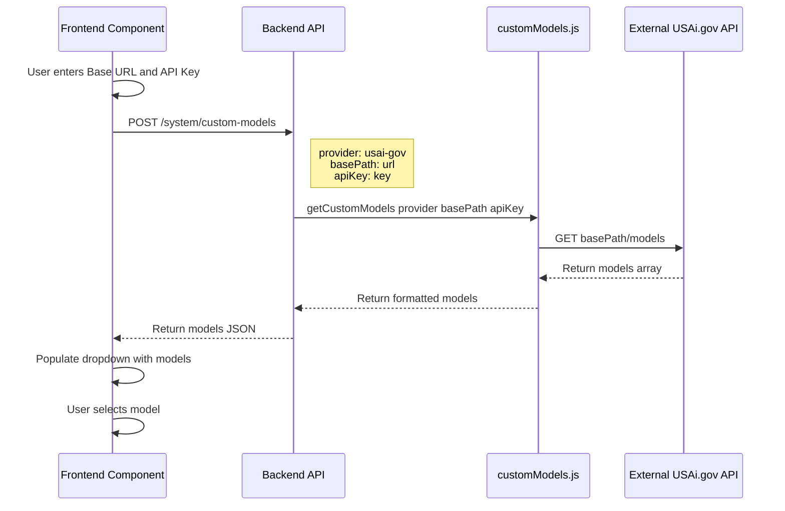
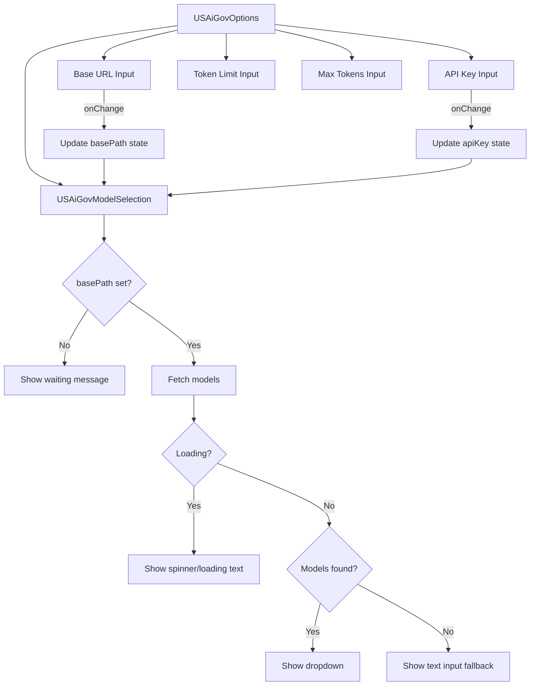

# USAi.gov Model Fetching Feature Plan

## Overview

This plan extends the USAi.gov provider implementation to support automatic model discovery. Instead of requiring users to manually type the model name, they can fetch available models from the USAi.gov API endpoint and select from a dropdown.

## Architecture

### How Model Fetching Works in AnythingLLM



### Data Flow

1. **Frontend** tracks basePath and apiKey state changes
2. When both are available, frontend calls `System.customModels("usai-gov", apiKey, basePath)`
3. **Backend** routes to [`/system/custom-models`](server/endpoints/system.js:1041) endpoint
4. [`getCustomModels()`](server/utils/helpers/customModels.js:59) dispatches to provider-specific fetch function
5. Provider function calls external API and formats response
6. Frontend receives models array and populates dropdown

---

## Files to Modify

### 1. Backend: server/utils/helpers/customModels.js

**Location:** [`customModels.js`](server/utils/helpers/customModels.js)

#### Changes Required:

**A. Add "usai-gov" to SUPPORT_CUSTOM_MODELS array (line ~51)**

```javascript
const SUPPORT_CUSTOM_MODELS = [
  // ... existing providers
  "sambanova",
  "lemonade",
  "usai-gov",  // ADD THIS
  // Embedding Engines
  "native-embedder",
  // ...
];
```

**B. Add case in getCustomModels switch statement (after line ~131)**

```javascript
case "lemonade":
  return await getLemonadeModels(basePath);
case "usai-gov":
  return await getUSAiGovModels(basePath, apiKey);
case "lemonade-embedder":
  return await getLemonadeModels(basePath, "embedding");
```

**C. Add getUSAiGovModels function (at end of file, before module.exports)**

The function should:
- Accept basePath and apiKey parameters
- Make GET request to `{basePath}/models` with Authorization header
- Return array of model objects with `id` property
- Handle errors gracefully with fallback or error message

```javascript
async function getUSAiGovModels(basePath = null, apiKey = null) {
  try {
    if (!basePath) return { models: [], error: "No base path provided" };

    const { OpenAI: OpenAIApi } = require("openai");
    const openai = new OpenAIApi({
      apiKey: apiKey || "not-needed",
      baseURL: basePath,
    });

    const models = await openai.models
      .list()
      .then((results) => results.data)
      .catch((e) => {
        console.error("USAi.gov:listModels", e.message);
        return [];
      });

    return {
      models: models.map((model) => ({
        id: model.id,
        name: model.id,
        organization: "USAi.gov",
      })),
      error: null,
    };
  } catch (e) {
    console.error("USAi.gov:getModels", e.message);
    return { models: [], error: e.message };
  }
}
```

---

### 2. Frontend: frontend/src/components/LLMSelection/USAiGovOptions/index.jsx

**Location:** [`USAiGovOptions/index.jsx`](frontend/src/components/LLMSelection/USAiGovOptions/index.jsx)

#### Current Implementation:
- Simple form with text input for model name
- No state management
- No API calls

#### New Implementation Pattern:
Based on [`LocalAiOptions/index.jsx`](frontend/src/components/LLMSelection/LocalAiOptions/index.jsx:147-219):

**A. Add imports**
```javascript
import React, { useEffect, useState } from "react";
import System from "@/models/system";
```

**B. Track basePath and apiKey state**
```javascript
const [basePath, setBasePath] = useState(settings?.USAiGovBasePath || "");
const [apiKey, setApiKey] = useState(settings?.USAiGovKey || null);
```

**C. Create ModelSelection sub-component**
```javascript
function USAiGovModelSelection({ settings, basePath, apiKey }) {
  const [customModels, setCustomModels] = useState([]);
  const [loading, setLoading] = useState(true);

  useEffect(() => {
    async function findCustomModels() {
      if (!basePath) {
        setCustomModels([]);
        setLoading(false);
        return;
      }
      setLoading(true);
      const { models } = await System.customModels(
        "usai-gov",
        typeof apiKey === "boolean" ? null : apiKey,
        basePath
      );
      setCustomModels(models || []);
      setLoading(false);
    }
    findCustomModels();
  }, [basePath, apiKey]);

  // Return loading state or dropdown
}
```

**D. Replace text input with dropdown**
- Show loading spinner while fetching
- Show "waiting for URL" when no basePath
- Show dropdown with fetched models when available
- Keep text input as fallback when no models found

---

## Detailed Component Structure



---

## Implementation Checklist

- [ ] **Backend Changes**
  - [ ] Add `"usai-gov"` to `SUPPORT_CUSTOM_MODELS` array in [`customModels.js`](server/utils/helpers/customModels.js:19-57)
  - [ ] Add `case "usai-gov":` to switch statement in [`getCustomModels()`](server/utils/helpers/customModels.js:63-138)
  - [ ] Create `getUSAiGovModels(basePath, apiKey)` function

- [ ] **Frontend Changes**
  - [ ] Add React state imports to [`USAiGovOptions/index.jsx`](frontend/src/components/LLMSelection/USAiGovOptions/index.jsx)
  - [ ] Add `System` import for API calls
  - [ ] Convert to stateful component tracking basePath and apiKey
  - [ ] Create `USAiGovModelSelection` sub-component
  - [ ] Implement model fetching with `useEffect`
  - [ ] Replace model text input with conditional dropdown/input
  - [ ] Add loading state UI feedback

---

## API Contract

### Request to USAi.gov
```
GET {basePath}/models
Headers:
  Authorization: Bearer {apiKey}
  Accept: application/json
```

### Expected Response Format (OpenAI-compatible)
```json
{
  "object": "list",
  "data": [
    {
      "id": "model-name-1",
      "object": "model",
      "created": 1686935002,
      "owned_by": "usai-gov"
    },
    {
      "id": "model-name-2",
      "object": "model",
      "created": 1686935002,
      "owned_by": "usai-gov"
    }
  ]
}
```

---

## Error Handling

| Scenario | Backend Response | Frontend Behavior |
|----------|-----------------|-------------------|
| No basePath provided | `{ models: [], error: "No base path provided" }` | Show "waiting for URL" |
| API key invalid | `{ models: [], error: "Unauthorized" }` | Show text input fallback |
| Network error | `{ models: [], error: "Connection failed" }` | Show text input fallback |
| Empty model list | `{ models: [], error: null }` | Show text input fallback |
| Success | `{ models: [...], error: null }` | Show dropdown with models |

---

## Testing Verification

After implementation:

1. Start dev server: `yarn dev:all`
2. Navigate to Settings > LLM Preference
3. Select USAi.gov provider
4. Enter valid Base URL
5. Enter API Key (if required)
6. Verify models dropdown populates
7. Select a model and save
8. Verify chat works with selected model

---

## Notes

- The implementation follows the same pattern used by LocalAI, LMStudio, and other OpenAI-compatible providers
- Using OpenAI SDK for the `/models` endpoint ensures consistent error handling
- Fallback to text input ensures users can still configure manually if API doesn't support model listing
