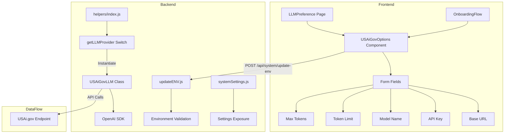

# Implementation Plan: Add USAi.gov LLM Provider to AnythingLLM

## Overview
This plan outlines the steps to add a new LLM provider called "USAi.gov" to AnythingLLM. Since the endpoint is OpenAI-compatible, we can leverage the existing OpenAI SDK patterns used throughout the codebase.

## Provider Details
- **Display Name**: USAi.gov
- **Provider Slug**: `usai-gov`
- **Environment Variable Prefix**: `USAI_GOV_`

## Architecture Diagram



## Files to Create

### 1. Backend Provider Class
**File**: [`server/utils/AiProviders/usaiGov/index.js`](server/utils/AiProviders/usaiGov/index.js)

This class will extend the OpenAI-compatible pattern used by GenericOpenAI. Key components:
- Constructor initializing OpenAI SDK with custom base URL
- Environment variable reading for configuration
- Chat completion methods (streaming and non-streaming)
- Token limit handling

```javascript
// Key environment variables:
// USAI_GOV_BASE_PATH - Base URL for the API
// USAI_GOV_API_KEY - API authentication key
// USAI_GOV_MODEL_PREF - Model identifier
// USAI_GOV_MODEL_TOKEN_LIMIT - Context window size
// USAI_GOV_MAX_TOKENS - Max tokens per response
```

### 2. Frontend Options Component
**File**: [`frontend/src/components/LLMSelection/USAiGovOptions/index.jsx`](frontend/src/components/LLMSelection/USAiGovOptions/index.jsx)

React component with form fields for:
- Base URL input (required)
- API Key input (password field)
- Model Name input (required)
- Token Limit input (number, required)
- Max Tokens input (number, required)

## Files to Modify

### 3. Environment Variable Mappings
**File**: [`server/utils/helpers/updateENV.js`](server/utils/helpers/updateENV.js:215)

Add new configuration block after line ~235 (after Generic OpenAI settings):

```javascript
// USAi.gov LLM Settings
USAiGovBasePath: {
  envKey: "USAI_GOV_BASE_PATH",
  checks: [isValidURL],
},
USAiGovModelPref: {
  envKey: "USAI_GOV_MODEL_PREF",
  checks: [isNotEmpty],
},
USAiGovTokenLimit: {
  envKey: "USAI_GOV_MODEL_TOKEN_LIMIT",
  checks: [nonZero],
},
USAiGovKey: {
  envKey: "USAI_GOV_API_KEY",
  checks: [],
},
USAiGovMaxTokens: {
  envKey: "USAI_GOV_MAX_TOKENS",
  checks: [nonZero],
},
```

### 4. LLM Provider Selection Helper
**File**: [`server/utils/helpers/index.js`](server/utils/helpers/index.js:190)

Add case in `getLLMProvider()` switch statement around line ~193:

```javascript
case "usai-gov":
  const { USAiGovLLM } = require("../AiProviders/usaiGov");
  return new USAiGovLLM(embedder, model);
```

Also add in `getLLMProviderClass()` function around line ~373.

### 5. Supported LLM Providers Validation
**File**: [`server/utils/helpers/updateENV.js`](server/utils/helpers/updateENV.js:958)

Add `"usai-gov"` to the `supportedLLM()` function array around line ~958.

### 6. Frontend LLM Preference Page
**File**: [`frontend/src/pages/GeneralSettings/LLMPreference/index.jsx`](frontend/src/pages/GeneralSettings/LLMPreference/index.jsx:406)

Add import at top:
```javascript
import USAiGovLogo from "@/media/llmprovider/usai-gov.png";
import USAiGovOptions from "@/components/LLMSelection/USAiGovOptions";
```

Add provider configuration to the LLMS array:
```javascript
{
  name: "USAi.gov",
  value: "usai-gov",
  logo: USAiGovLogo,
  options: (settings) => <USAiGovOptions settings={settings} />,
  description: "Connect to USAi.gov OpenAI-compatible LLM service",
  requiredConfig: [
    "USAiGovBasePath",
    "USAiGovModelPref",
    "USAiGovTokenLimit",
  ],
},
```

### 7. Onboarding Flow
**File**: [`frontend/src/pages/OnboardingFlow/Steps/LLMPreference/index.jsx`](frontend/src/pages/OnboardingFlow/Steps/LLMPreference/index.jsx:284)

Add same imports and provider configuration as above.

### 8. System Settings Exposure
**File**: [`server/models/systemSettings.js`](server/models/systemSettings.js:641)

Add settings exposure in `currentSettings()` method:
```javascript
// USAi.gov Keys
USAiGovBasePath: process.env.USAI_GOV_BASE_PATH,
USAiGovModelPref: process.env.USAI_GOV_MODEL_PREF,
USAiGovTokenLimit: process.env.USAI_GOV_MODEL_TOKEN_LIMIT,
USAiGovKey: !!process.env.USAI_GOV_API_KEY,
USAiGovMaxTokens: process.env.USAI_GOV_MAX_TOKENS,
```

### 9. Provider Logo
**File**: `frontend/src/media/llmprovider/usai-gov.png`

Add a logo image (recommended size: 48x48 or 64x64 pixels, PNG format).

### 10. Environment Example Files
**Files**:
- [`server/.env.example`](server/.env.example:92)
- [`docker/.env.example`](docker/.env.example:86)

Add commented configuration examples:
```bash
# LLM_PROVIDER='usai-gov'
# USAI_GOV_BASE_PATH='https://api.usai.gov/v1'
# USAI_GOV_API_KEY=your-api-key
# USAI_GOV_MODEL_PREF='gpt-4'
# USAI_GOV_MODEL_TOKEN_LIMIT=4096
# USAI_GOV_MAX_TOKENS=1024
```

## Optional Enhancements

### 11. Agent Support
**Files**:
- [`server/utils/agents/aibitat/index.js`](server/utils/agents/aibitat/index.js:1226)
- [`server/utils/agents/aibitat/providers/index.js`](server/utils/agents/aibitat/providers/index.js:12)
- Create: `server/utils/agents/aibitat/providers/usaiGov.js`

If agent/tool calling support is needed, create a provider class similar to [`server/utils/agents/aibitat/providers/genericOpenAi.js`](server/utils/agents/aibitat/providers/genericOpenAi.js).

### 12. Provider Privacy Constants
**File**: [`frontend/src/components/ProviderPrivacy/constants.js`](frontend/src/components/ProviderPrivacy/constants.js:152)

Add privacy information if needed for the privacy information modal.

### 13. Free-form LLM Selection
**File**: [`frontend/src/pages/WorkspaceSettings/ChatSettings/WorkspaceLLMSelection/index.jsx`](frontend/src/pages/WorkspaceSettings/ChatSettings/WorkspaceLLMSelection/index.jsx:14)

If the model selection should allow free-form text input (like Azure/Bedrock), add `"usai-gov"` to the `FREE_FORM_LLM_SELECTION` array.

## Implementation Order

1. **Create provider logo** - Get or create the visual asset first
2. **Backend provider class** - Core functionality
3. **Environment variable mappings** - Backend configuration handling
4. **Provider registration** - Wire up the provider in helpers
5. **System settings exposure** - Make settings available to frontend
6. **Frontend options component** - UI for configuration
7. **Frontend provider registration** - Add to LLM selection pages
8. **Environment examples** - Documentation for users
9. **Agent support** (optional) - If tool calling is needed
10. **Testing** - Verify end-to-end functionality

## Testing Checklist

- [ ] Provider appears in LLM dropdown on Settings page
- [ ] Provider appears in LLM dropdown during onboarding
- [ ] Configuration form saves correctly
- [ ] Environment variables are persisted to .env file
- [ ] Chat completions work (non-streaming)
- [ ] Chat completions work (streaming)
- [ ] Token limits are respected
- [ ] Error handling for invalid API keys
- [ ] Error handling for unreachable endpoint
- [ ] Agent functionality works (if implemented)
